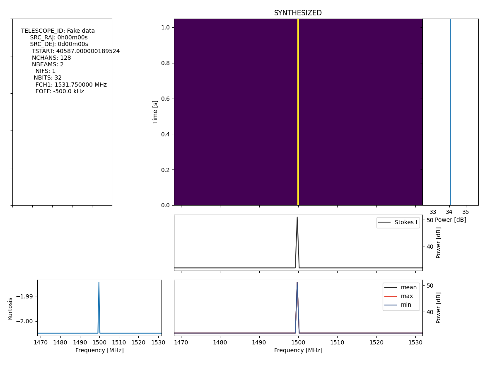

# Fundamental Beamforming Tests

For the purposes of brevity, the RAW data is spoken about programmatically, with dimensions [pol, time, chan, ant].

The synthesized tests have the following RAW block dimension, unless otherwise stated: [A: 4, F: 128, T: 16384, P: 2, 8bit-complex].

One coherent and one incoherent beam are formed, unless otherwise stated;

The BLADE-CLI is run with `-C 64` to ensure that the coarse frequency-channel stepping works, and with `-T 4096`, unless otherwise stated.

Each test is collapsed below.

0. cal_all Ones, delays Zeros, RAW signal in [:, :, NCHAN/2, :]

GUPPI RAW Input

Beamformed Output (No upchannelization)

Beamformed Output (upchannelization rate of 4)

1. cal_all Ones, delays Zeros, RAW signal in [:, :, NCHAN/2, NANT/2]

GUPPI RAW Input

Beamformed Output (No upchannelization)

Beamformed Output (upchannelization rate of 4)

